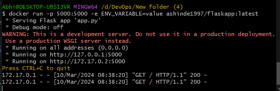
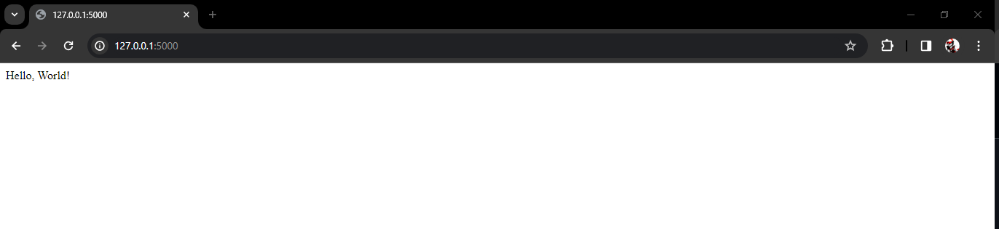

# FlaskTest

## Step 1: Add Flask Application and Test File

1. Create a Flask application with a `Dockerfile`.
2. Write your Flask application.
3. Create a test file named `test_app.py` using pytest.
4. Create Docker File With Multilevel

## Step 2: Create GitHub Actions Workflow

Create a GitHub Actions workflow YAML file (e.g., `.github/workflows/python-app.yml`)

## Step 3: Add Secrets to GitHub Repository
1. Go to your GitHub repository.
2. Click on "Settings" tab.
3. In the left sidebar, click on "Secrets".
4. Click on "New repository secret".
5. Add your Docker Hub username as DOCKERHUB_USERNAME and Docker Hub token as DOCKERHUB_TOKEN. 
   
## Step 4: Create Docker Token 

1. Go to https://hub.docker.com/
2. Go to My Acount Select Security
3. Create Access Token

## Step 5: Run

1. Pull Command :- docker pull ashinde1997/flaskapp
2. Run Command :- docker run -p 5000:5000 -e ENV_VARIABLE=value ashinde1997/flaskapp:latest
